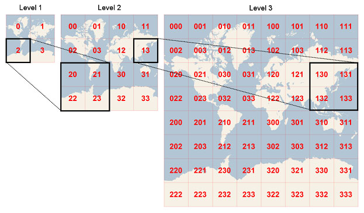

<!-- page_number: true -->

# Manipuler la geographie

- Geometry
- Operateurs
- Encodage
- Outils / Bibliotheques
- Indexation / Sharding
- Utilisation OSM

---

# Travailler avec les geométries 

- Modèles :
	- Points
	- Ligne (multi)
	- Polygones (multi)

- Coordonnées X/Y/Z - M

- OGC - ST_Geometry - http://www.opengeospatial.org/

<p align="right"><image src="images/geometries.png" height="300"></image></p>

---

# Problématiques associées à la donnée géographique

- [Système de coordonnées (WGS 84/ WebMercator) - CRS/SRS](http://spatialreference.org/)
	- Bibliotheques de reprojection
	- Calcul de distances / Précision de la donnée
- [Computational Geometry / Précision des nombres](https://en.wikipedia.org/wiki/Computational_geometry)
	- Implémentation des opérateurs geometriques
- Taille en octets des geometries
	- contour de région précis -> 100 ko
	 	
- Indexation / Volumes
	- accès "Random"


---
# Operateurs

- Tests booleen
	- intersection, touche, à l'intérieur, ont des frontières communes, ...  
- Modifications / Création
	- union / différence / intersection
<p align="center"><image src="images/union.jpg" height="100"></image></p>

---

# Operateurs Vectoriels (2)

- Buffer / Delaunay / Voronoi ... 

<p align="center"><image src="images/buffer.jpg" height="400"><image src="images/delaunay_voronoi.png"></image></image>
</p>

---

# Operateurs Raster (3)

- Rasterisation -> Matrices

<p align="center"><image src="images/ex_rasterisation.png" height="400"></image>
</p>

---

## Exemples - Operateurs ST_* OGC

<table> 
<th>
Constructors
</th>
<th>
Operations
</th>
<th>Relationship Tests</th>
<th>Accessors</th>
<tr>
<td>
<p style="font-size:small">
ST_AsBinary
ST_AsGeoJSON
ST_AsJSON
ST_AsShape
ST_AsText - Notes on Hive usage of ST_AsText
ST_GeomCollection
ST_GeomFromGeoJSON
ST_GeomFromJSON
ST_GeomFromShape
ST_GeomFromText
ST_GeomFromWKB
ST_GeometryType
ST_LineFromWKB
ST_LineString
ST_MLineFromWKB
ST_MPointFromWKB
ST_MPolyFromWKB
ST_MultiLineString
ST_MultiPoint
ST_MultiPolygon
ST_Point
ST_PointFromWKB
ST_PointZ
ST_PolyFromWKB
ST_Polygon
ST_SetSRID
</p>
</td>
<td>
<p style="font-size:small">
ST_Aggr_ConvexHull
ST_Aggr_Intersection
ST_Aggr_Union
ST_Bin
ST_BinEnvelope
ST_Boundary
ST_Buffer
ST_ConvexHull
ST_Difference
ST_Envelope
ST_ExteriorRing
ST_InteriorRingN
ST_Intersection 
ST_SymmetricDiff 
ST_Union
</p>
</td>
<td>
<p style="font-size:small">
ST_Contains
ST_Crosses
ST_Disjoint
ST_EnvIntersects
ST_Equals
ST_Intersects
ST_Intersects
ST_Overlaps
ST_Relate
ST_Touches
ST_Within
</p>
</td>
<td>
<p style="font-size:small">
ST_Area
ST_Centroid
ST_CoordDim
ST_Dimension
ST_Distance
ST_GeodesicLengthWGS84
ST_GeometryN
ST_Is3D
ST_IsClosed
ST_IsEmpty
ST_IsMeasured
ST_IsSimple
ST_Length
ST_M
ST_MaxM
ST_MaxX
ST_MaxY
ST_MaxZ
ST_MinM
ST_MinX
ST_MinY
ST_MinZ
ST_NumGeometries
ST_NumInteriorRing
ST_NumPoints
ST_PointN - Notes on Hive usage of ST_PointN
ST_IsRing
ST_SRID
ST_StartPoint
ST_EndPoint
ST_X
ST_Y
ST_Z
</p>
</td>
</tr>
</table>
</p>

---
# Encodages des Geometries - Stockage

- OGC (WKT / WKB) (Texte ou Binaire)
- GeoJSON (JSON)
- GML (XML)
- KML (XML)
- Shape (Binaire)

Important dans les applications Big Data -> volume, specification

---

# WKT (Well known Text)
```
POINT(6 10)
LINESTRING(3 4,10 50,20 25)
POLYGON((1 1,5 1,5 5,1 5,1 1))
MULTIPOINT((3.5 5.6), (4.8 10.5))
MULTILINESTRING((3 4,10 50,20 25),(-5 -8,-10 -8,-15 -4))
MULTIPOLYGON(((1 1,5 1,5 5,1 5,1 1),(2 2,2 3,3 3,3 2,2 2)),((6 3,9 2,9 4,6 3)))	
```

# WKB (Well Known Binary)

```
POINT(2.0 4.0) is represented as: 

00 00000001 4000000000000000 4010000000000000, 

where:
1-byte integer 00 or 0: big endian
4-byte integer 00000001 or 1: POINT (2D)
8-byte float 4000000000000000 or 2.0: x-coordinate
8-byte float 4010000000000000 or 4.0: y-coordinate

```
---
# GeoJSON

Utilisation Web essentiellement - https://tools.ietf.org/html/rfc7946

```
{
  "type": "Feature",
  "geometry": {
    "type": "Point",
    "coordinates": [125.6, 10.1]
  },
  "properties": {
    "name": "Dinagat Islands"
  }
}
```

Chez ESRI -> FeatureSet

GUI : [http://geojson.io](http://geojson.io)

---

# Shape - ESRI
Format binaire https://www.esri.com/library/whitepapers/pdfs/shapefile.pdf 

Equivalent au WKB, plus ancien, utilisé dans le format "ShapeFile" .shp - très connu.

<p align="center"><image src="images/shape.png" height="300"></image></p>


---

# Bibliotheques Geometriques
	
- [OGR / GDAL (C++ / Wrappers)](http://gdal.org/)
- [ESRI-Geometry-API (JVM)](https://github.com/Esri/geometry-api-java)
- [JTS (JVM)](https://github.com/locationtech/jts)
- [GEOS (C++)](https://trac.osgeo.org/geos)
- [CGAL (C++)](https://www.cgal.org/)
... 

---

# Manipulation geometries (1/3)

Python - OGR
```

from osgeo import ogr

wkt = "LINESTRING (1181866.263593049 615654.4222507705, 1205917.1207499576 623979.7189589312, 1227192.8790041457 643405.4112779726, 1224880.2965852122 665143.6860159477)"
geom = ogr.CreateGeometryFromWkt(wkt)
for i in range(0, geom.GetPointCount()):
    # GetPoint returns a tuple not a Geometry
    pt = geom.GetPoint(i)
    print "%i). POINT (%d %d)" %(i, pt[0], pt[1])

```

[https://pcjericks.github.io/py-gdalogr-cookbook/geometry.html](https://pcjericks.github.io/py-gdalogr-cookbook/geometry.html)

---

# Exemple création buffer (2/3)

```
from osgeo import ogr

wkt = "POINT (1198054.34 648493.09)"
pt = ogr.CreateGeometryFromWkt(wkt)
bufferDistance = 500
poly = pt.Buffer(bufferDistance)
print "%s buffered by %d is %s" % (pt.ExportToWkt(), \ 
        bufferDistance, poly.ExportToWkt())
```

[https://pcjericks.github.io/py-gdalogr-cookbook/geometry.html](https://pcjericks.github.io/py-gdalogr-cookbook/geometry.html)


---

# Exemple JVM (java)

```
// geometry is shape binary encoded
byte[] content = way.getAs("geometry");
System.out.println(Arrays.asList(content));

Geometry g = GeometryEngine.geometryFromEsriShape(content,
  		Type.Polyline);

// we can work on geometries, compute buffers, rasterize  ...

// dump geojson geometry
System.out.println(GeometryEngine.geometryToGeoJson(g));
```

[https://github.com/Esri/geometry-api-java](https://github.com/Esri/geometry-api-java)

```
<dependency>
  <groupId>com.esri.geometry</groupId>
  <artifactId>esri-geometry-api</artifactId>
  <version>1.2.1</version>
</dependency>
```


---

# Indexation / Sharding / Jointures

Retrouver rapidement des informations par "proximité" spatiale. 

L'analyse des geometries est couteuse (CPU), il faut analyser tous les points.

Filtre primaire / secondaire

<p align="center"><image src="images/F1F2.png" height="300"></image></p>

F1 : Utilisation des BBox (Bouding Box) -> 4 tests flottants
F2 : Utilisation de la geometrie

---
# Formes d'indexes

- Grid
- GeoHash
- QuadTree - RTree
- TwinIndices - Format3
- ...

plus d'infos

[https://en.wikipedia.org/wiki/Spatial_database](https://en.wikipedia.org/wiki/Spatial_database)

---

# Focus on GeoHash



---

Exemple - Scala [https://github.com/davidallsopp/geohash-scala](https://github.com/davidallsopp/geohash-scala)

```
import com.github.davidallsopp.geohash.GeoHash._

encode(12.345, 123.456)  // latitude, longitude

    // res0: String = wdpy1r3fv6c9  // using default precision of 12 chars

encode(lat=12.345, lon=123.456)  // named arguments to avoid mixing up latitude and longitude

    // res1: String = wdpy1r3fv6c9  // using default precision of 12 chars

encode(12.345, 123.456, 6)  // specify precision of 6 chars

    // res2: String = wdpy1r

decode("wdpy1r3fv6c9")

    // res2: (Double, Double) = (12.345000011846423,123.45599988475442)
```

---

# En environnement BigData

Big Data -> Parallelisme des traitements, "Bring Program on Datas", Stream the datas

Critères importants :

- Temps de parsing - CPU (Encoding)
- Taille des éléments stockés - I/O performance
- Volumes / Indexation - F1/F2

---

# Back to OSM

---

# Structuration des données OSM

- Node (1)

```
<node id="298884269" lat="54.0901746" lon="12.2482632" 
  user="SvenHRO" uid="46882" visible="true" version="1" 
  changeset="676636" timestamp="2008-09-21T21:37:45Z"/>
```

- Way (2)

```
<way id="26659127" user="Masch" uid="55988" visible="true" 
	version="5" changeset="4142606" 
    timestamp="2010-03-16T11:47:08Z">
  <nd ref="292403538"/>
  <nd ref="298884289"/>
  ...
  <nd ref="261728686"/>
  <tag k="highway" v="unclassified"/>
  <tag k="name" v="Pastower Straße"/>
 </way>
```

---

- Relation (3)

```
 <relation id="56688" user="kmvar" uid="56190" visible="true" 
   version="28" changeset="6947637" 
   timestamp="2011-01-12T14:23:49Z">
  <member type="node" ref="294942404" role=""/>
  ...
  <member type="node" ref="364933006" role=""/>
  <member type="way" ref="4579143" role=""/>
  ...
  <member type="node" ref="249673494" role=""/>
  <tag k="name" v="Küstenbus Linie 123"/>
  <tag k="network" v="VVW"/>
  <tag k="operator" v="Regionalverkehr Küste"/>
  <tag k="ref" v="123"/>
  <tag k="route" v="bus"/>
  <tag k="type" v="route"/>
 </relation>
```

---

# Formats de Téléchargements

 - XML -> format d'origine
 - [PBF](https://wiki.openstreetmap.org/wiki/PBF_Format) -> protocol buffer - Très compact

<p align="center"><image src="images/download.png" height="500"></image></p>


---


# Utilisation des données OSM

plusieurs chemins

0 - OpenStreetmap.org -> extract XML (petit ensemble)

1 - Postgis / Postgres

2 - à partir de Fichiers


---

# 1 - PostGIS / Postgresql

Outils existants : Osmosis, osm2pgsql, ....

```
 osm2pgsql -s -U postgres -d nameofdatabase  \
      /file/path/toosm/fileorpbf/name.osm
```

ex : Planet import on custom E5-1650 (32GB RAM - 6 cores) / SSD
```
Processing: Node(1507455k 301.6k/s) Way(141480k 37.49k/s) Relation(1469760 81.71/s)  parse time: 26760s
.....
Osm2pgsql took 40016s overall (11.1 hours)

real    666m56.457s
user    335m7.557s
sys     40m0.366s
```

Geofabrik / Openstreetmap.fr propose des extracts plus petits -> economie de temps

---

# 2 - à partir de fichiers


## Etapes de lecture

- Parsing du fichier

- Reconstruction des geometries (Ways, Polygons)

## Librairies :

- [osm-pbf-parser (Javascript)](https://www.npmjs.com/package/osm-pbf-parser)
- [ruby osm parsing](https://github.com/systemed/ruby_osmpbf)
- [crosby.binary (JVM)]()
- [imp osm (python)](https://imposm.org/docs/imposm.parser/latest/)

-> ATTENTION : reconstruction des polylignes / polygones

---

# Autre possibilité - AVRO (Big Data) 

http://avroosm.s3-website-eu-west-1.amazonaws.com/index.html
http://bit.ly/2gPIw8B

<p align="center"><image src="images/avroosm.png" height="500"></image></p>

Polylignes et polygones déjà préconstruits

---

# Stack Big Data

Librairies / Solutions Geospatiales (BigData)

[Magellan](https://github.com/harsha2010/magellan) - HortonWorks
[Geomesa](http://www.geomesa.org/) - Location Tech
[ESRI-UDF](https://github.com/Esri/spatial-framework-for-hadoop/wiki/UDF-Documentation) - ESRI
...


