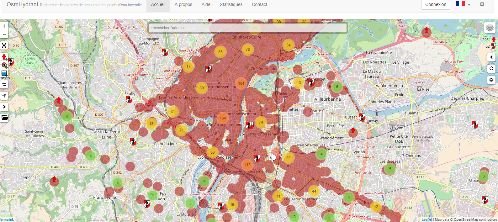

# Projet Datascience / ML / OSM

---

# Plan

- Projets Statistiques
	- zones à mapper
	- ... 
	
- Projets existants ML
	- OpenSolar Map
	- DeepOSM

- Proposition
	- BHYNO

---

# "Zones à mapper"

comptage / comparaison de référentiels pour observer les plus ou les moins dans la base de donnée OSM.

@@Image

Mettre en évidence les zones blanches

---

# [OpenSolar Map](https://github.com/opensolarmap)

- Basé sur le cadastre
	- Utilisation du bati
	- Détection de l'orientation des toits

Initialement - basé sur maproulette
Liste d'objet, parcours de la liste d'objet pour expliquer ce que c'est.

depuis, utilise ML pour la classification des tois (à partir des images satellites), pour déterminer l'orientation de toits.

- Keras - Tensor Flow

---

# [DeepOSM](https://github.com/trailbehind/DeepOSM)

Classification d'objets, à partir d'images satellite (Visible + IR), en utilisant OSM, pour le training (routes, bati).

Prédiction sur le routes

- Tensor Flow

---

# (Proposition - BHYNO - Amelioration de la saisie d'hydrants)

- Aider les pompiers à mieux mettre à jour leurs bases d'hydrants

	- https://www.osmhydrant.org/fr/

---

# (Proposer un outil d'aide à la saisie)

- Prédiction de la présence d'hydrants , en fonction des objets allentours, de la population, des batiments.
	- Modèle à mettre en place
	- Indiquer les probabilité de présence
	- suggestion d'ajouts ? d'améliorations ? détection d'anomalies / caractérisation de l'emplacement

- Gamification de la saisie ?

--> principes pouvant être appliqués à d'autres objets

